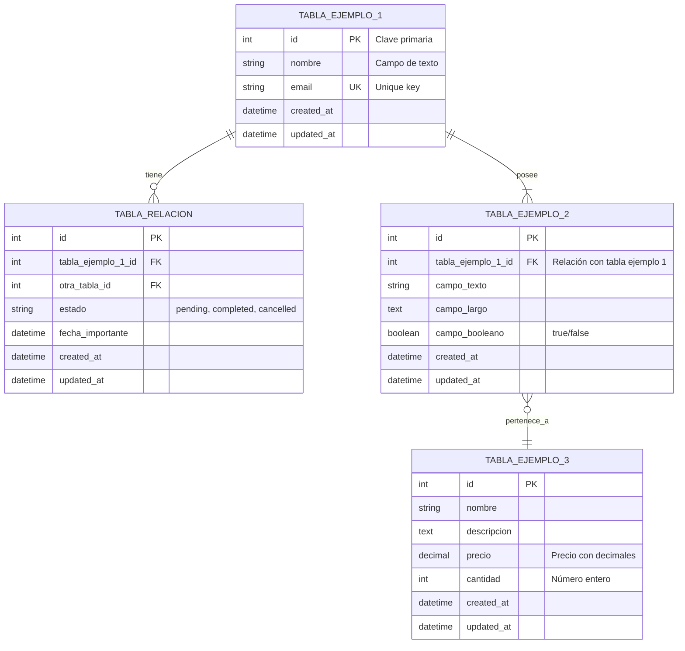

# Esquema de la Base de Datos: [NOMBRE DEL PROYECTO]

**Versión:** 1.0
**Fecha:** [Fecha de creación]

Este documento visualiza la arquitectura de la base de datos del proyecto. Define las tablas principales, sus relaciones y campos importantes.

---

## Diagrama de Relaciones (ERD)

[Instrucciones: Utiliza Mermaid para crear un diagrama de entidad-relación que represente tu base de datos. Elimina las tablas de ejemplo y crea las tuyas propias según tu proyecto.]

---

## Descripción de Tablas

[Opcional: Describe cada tabla en detalle si es necesario aclarar conceptos de negocio]

### [NOMBRE_TABLA_1]

**Propósito:** [Describe para qué sirve esta tabla]

**Campos importantes:**
- `campo_1`: [Descripción del campo y su propósito]
- `campo_2`: [Descripción del campo y su propósito]
- `campo_relacion_id`: [Descripción de la relación con otra tabla]

**Relaciones:**
- Relación con `[OTRA_TABLA]`: [Tipo de relación - uno a muchos, muchos a muchos, etc.]

---

### [NOMBRE_TABLA_2]

**Propósito:** [Describe para qué sirve esta tabla]

**Campos importantes:**
- `campo_1`: [Descripción del campo y su propósito]
- `campo_2`: [Descripción del campo y su propósito]

**Relaciones:**
- Relación con `[OTRA_TABLA]`: [Tipo de relación]

---

### [NOMBRE_TABLA_3]

**Propósito:** [Describe para qué sirve esta tabla]

**Campos importantes:**
- `campo_1`: [Descripción del campo y su propósito]
- `campo_2`: [Descripción del campo y su propósito]

**Relaciones:**
- Relación con `[OTRA_TABLA]`: [Tipo de relación]

---

## Índices y Optimizaciones

[Opcional: Documenta índices importantes para el rendimiento]

- **Tabla `[NOMBRE_TABLA]`:**
  - Índice en `campo_x` para búsquedas rápidas
  - Índice compuesto en `(campo_a, campo_b)` para consultas específicas
  - Índice único en `campo_email`

---

## Notas de Implementación

[Opcional: Agrega notas técnicas importantes]

- **Gestión de Archivos/Imágenes:** [Si usas un paquete como Spatie Media Library, especifícalo aquí]
- **Campos JSON:** [Si tienes campos JSON, explica su estructura]
- **Soft Deletes:** [Indica si algunas tablas usan eliminación suave]
- **Timestamps:** [Todas las tablas tienen created_at/updated_at, o hay excepciones]
- **Otras consideraciones:** [Cualquier detalle técnico relevante]

---

## Historial de Cambios

[Opcional: Documenta cambios importantes al esquema]

**Versión 1.1 - [Fecha]:**
- Se agregó la tabla `[NUEVA_TABLA]` para [propósito]
- Se añadió el campo `[nuevo_campo]` a `[TABLA_EXISTENTE]`

**Versión 1.0 - [Fecha inicial]:**
- Diseño inicial del esquema de base de datos

---

**Notas Finales:**
[Cualquier información adicional sobre la base de datos o convenciones que el equipo debe conocer]
